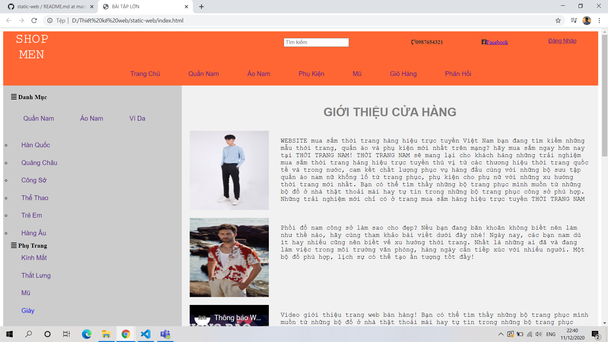
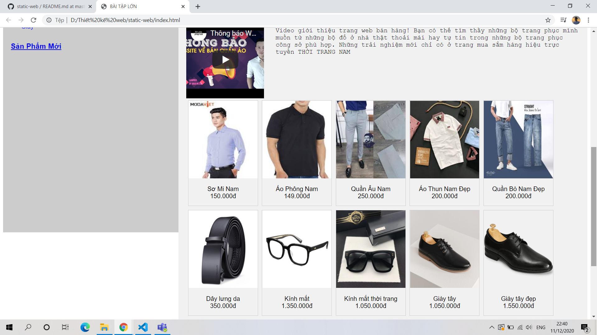
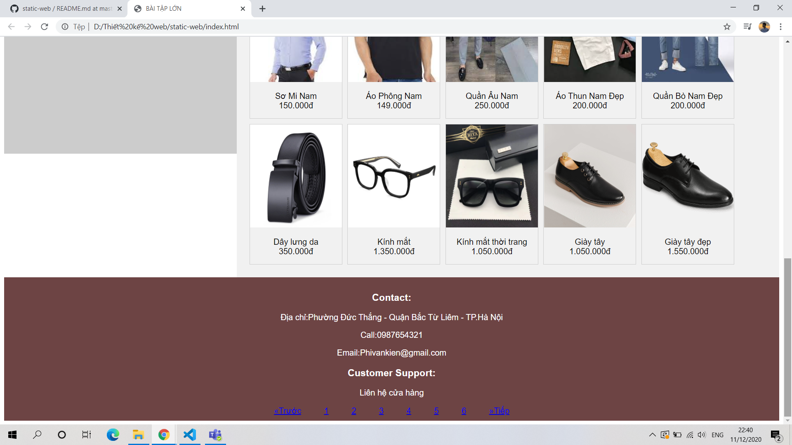

# landingpage
Dưới đây là trang web bán hàng quần áo nam của em!
Em sử dụng HTML và CSS để làm phần bài tập này, thiết kế có phần đơn giản nhưng cũng đã có các chức năng cơ bản của một trang web cần có.
Trang web có 3 phần header, body và footer
    Phần header gồm có tên shop, danh mục tìm kiếm, liên hệ điện thoại, facebook và các danh mục
    Phần body gồm các danh mục quần áo, phụ kiện, giới thiệu về shop, các mặt hàng mới và video
    Phần footer gầm có liên hệ, hỗ trợ khách hàng và chuyển trang mới.
Trong bài tập này em có sử dụng nhiều loại thẻ, font chữ khác nhau để tạo nên sự đa dạng cho trang web.
Dưới đây là hình ảnh về trang web em tạo được

